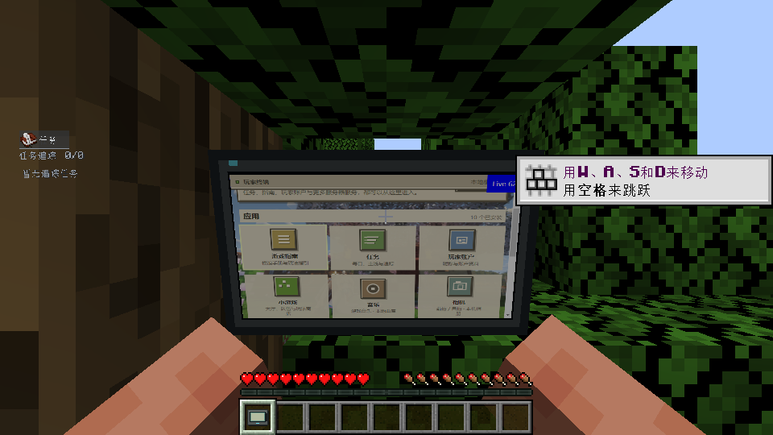
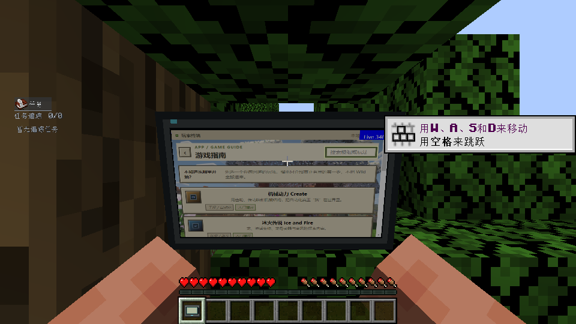

# 131 手持终端原生验收 · 2026-10-03

直接手持终端现在把方向键和 Enter 送入真实 MCEF 页面，无需先右键打开界面。现有动态纹理路径已在原生 Minecraft 中验证：手持时 DOM 定时变化、CEF onPaint 持续发生，640×400 GPU 纹理哈希随页面变化。

初始候选包综合验收 **203/203**；最终候选包对 Enter / 小键盘 Enter 长按和自定义游戏方向键状态补测 **112/112**。两个候选包只有 `TerminalHeldInput.class` 不同，其余 151 项逐字节相同。

覆盖主手、副手、另一手持物品、双终端单次派发、四向焦点移动、手持 Enter 打开指南、旧页面按键不释放到新页面、聊天和其他 Screen 隔离、失焦和未持有释放、原有终端 Screen 操作与 ESC 返回手持，以及 Core 输入包装的 finally。补测确认 Enter repeat 不会连续确认新页面，自定义方向键原游戏状态与点击队列清空。WASD / F / B / Tab / Ctrl+Tab 保留原有路径。

两轮验收客户端及服务端正常退出码均为 0。真正断开世界后，终端 shell / content / 捕获目标 / 按住集合 / GL 纹理均为 0；CEF clients 回到非终端基线 1。中间一次补测因在加载 Screen 仍打开时发送 Enter 而超时，工具增加加载完成等待后，同一产品候选包通过；失败回执与正常退出记录保留。

[详细 JSON 证据](131-native-evidence-20261003.json)包含候选 SHA、产品源码 SHA、逐项断言、原生采样、资源基线、运行目录和正常退出回执。[检查工具说明](../../tests/held-input/README.md)提供运行方式。

这次使用选定依赖集与真实 MC / MCEF 的原生键盘入口、QA 辅助焦点。**physicalOSInput=false**，物理键鼠验收待可用通道；未复测完整 523/525 包业务，未部署。MCEF 产品 JAR 未修改。

